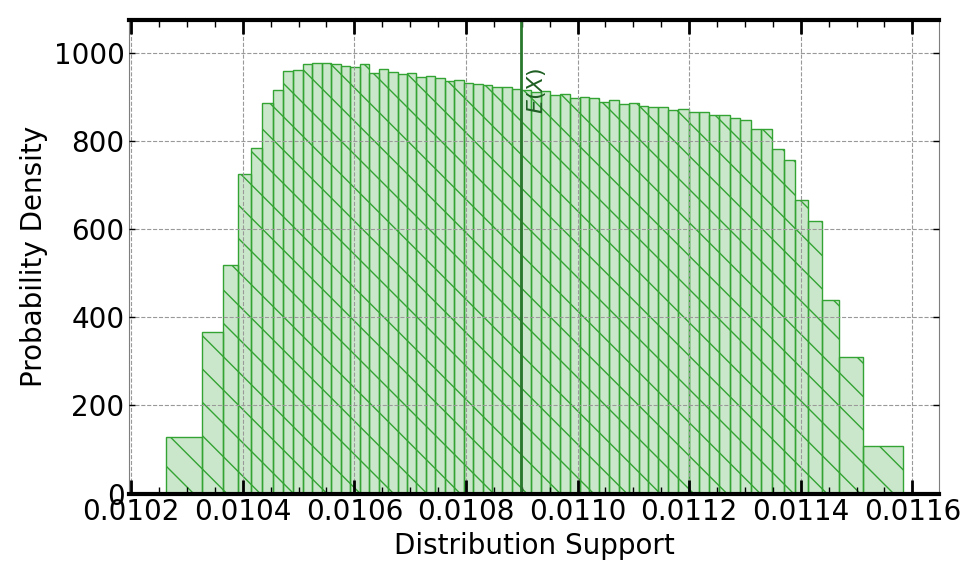

[](https://signaloid.io/repositories?connect=https://github.com/signaloid/Signaloid-Demo-Electronics-ResistorPowerDissipation#gh-dark-mode-only)
[](https://signaloid.io/repositories?connect=https://github.com/signaloid/Signaloid-Demo-Electronics-ResistorPowerDissipation#gh-light-mode-only)

# Example: Resistor Power Dissipation
This is a minimal example that demonstrates the effect of uncertainty in
resistance and voltage on the power dissipation of the resistor.

## Getting started

Use the "add to signaloid.io" image button to add this application to your
Signaloid Cloud account and run it.

You can fork this repository on GitHub, or clone it with:
```sh
git clone git@github.com:signaloid/Signaloid-Demo-Electronics-ResistorPowerDissipation.git
```

This repository does not include any build system. The Signaloid Cloud Compute
Engine handles building the application.

## Inputs
This example does not accept command-line arguments or inputs.

The example defines the following constants which it uses for computing the result:

- Nominal resistance of the resistor: $1000 \hspace{0.5ex} \Omega$.
- Tolerance of the resistor, assuming a gold-band resistor: $0.05 \\% $.
- Nominal voltage of the circuit: $3.3 \hspace{0.5ex} \mathrm{V}$.
- Standard deviation for the voltage of the circuit: $0.01 \hspace{0.5ex} \mathrm{V}$.

With these constants, the example creates the following values and then uses them in Equation 1 for $\mathrm{V}$ and $\mathrm{R}$:

| Voltage Distribution (Volts) | Resistance Distribution (Ohms) |
| ---- | ---- |
| <p align="center">(C0-L+)</p> | <p align="center">(C0-L+)</p> |
|  |  |


## Output

Running this application computes the power dissipation of the resistor (Equation 1) assuming
the actual resistance value and the supplied voltage both are uncertain. 

$$P=\frac{V^2}{R} \tag{1}$$

<br />

| Resistor Power Dissipation Distribution (Watts) | 
| ---- |
| <p align="center">(C0-L+)</p> |
| <p align="center"></p> |

## Usage

This example does not accept command-line arguments or inputs.

## Repository Structure

This is a simple repository with a single source file and entry point:
`src/main.c`.
